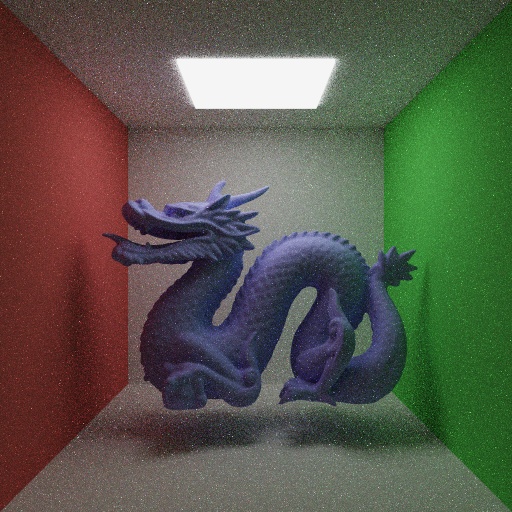
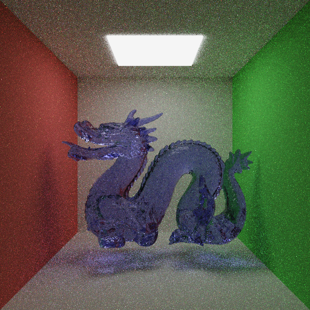

# Kengine
Учебный движок, разрабатываемый в рамках курса "Фотореалистичный рендеринг изображений" авторства Н. И. Лисицы.
Проект реализован на современном стандарте C++ с минимумом зависимостей.

### Примеры

